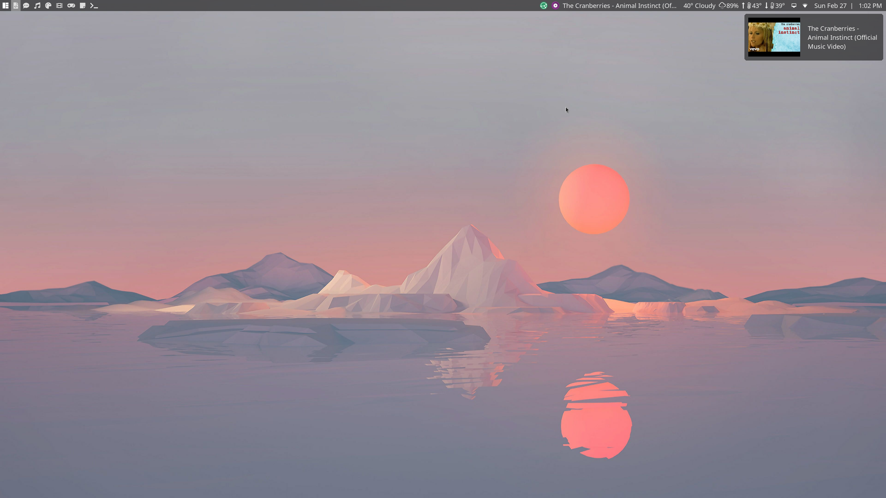
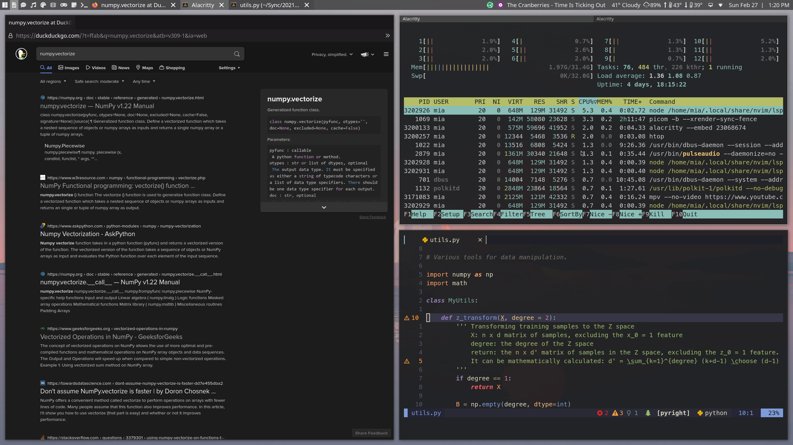

# AwesomeWM Configurations

My rice of AwesomeWM based off of [WillPower3309's AwesomeWM dotfiles](https://github.com/WillPower3309/awesome-dotfiles).

Screenshots
----------



Key Mappings
------------

| Action                        | `ModKey` = `Super/Windows` |
|-------------------------------|----------------------------|
| Full list of key bindings | `ModKey` +`s` |
| Terminal | `ModKey` + `ENTER` |
| Tabbed Terminal | `ModKey` + `CONTROL` + `ENTER` |
| Firefox browser | `ModKey` + `ALT` + `SPACE` |
| Rofi app launcher | `ALT` + `SPACE` |
| Move window to master position | `ModKey` + `SHIFT` + `ENTER` |
| Move window up | `ModKey` + `SHIFT` + `k` |
| Move window down | `ModKey` + `SHIFT` + `j` |
| Move window left | `ModKey` + `SHIFT` + `h` |
| Move window right | `ModKey` + `SHIFT` + `l` |
| Focus window up | `ModKey` + `k` |
| Focus window down | `ModKey` + `j` |
| Focus window left | `ModKey` + `h` |
| Focus window right | `ModKey` + `l` |
| Full screenshot | `PRINT SCREEN` |
| Current window screenshot | `ModKey` + `PRINT SCREEN` |
| Selection screenshot | `ModKey` + `SHIFT` + `PRINT SCREEN` |
| Increase gap | `ModKey` + `SHIFT` + `-` |
| Decrease gap | `ModKey` + `-` |
| Power Menu | `ModKey` + `SHIFT` + `ESCAPE` |

Dependencies
------------
- feh
- Alacritty Terminal
- rofi
- Scrot (screenshot utility)
- Flameshot (screenshot utility)
- [My scripts](https://github.com/kaykay38/scripts) for screenshots and other things.

#### Optional Dependencies
- greenclip (clipboard manager)
- bat (rust cat clone)

Installation
------------
Clone this repo into your `$HOME/.config` directory as `awesome`.

Copy and paste this into the terminal.
```bash
git clone https://github.com/kaykay38/awesome-config $HOME/.config/awesome
```
